# Sơ đồ Use Case Website Bán Hàng (Mermaid)

```mermaid
graph TB
    subgraph Actors
        Customer[Khách hàng]
        RegCustomer[Khách hàng đã đăng ký]
        Admin[Quản trị viên]
        SalesStaff[Nhân viên bán hàng]
        PaymentSys[Hệ thống thanh toán]
        ShippingSys[Hệ thống vận chuyển]
    end

    subgraph "Quản lý tài khoản"
        UC1[Đăng ký tài khoản]
        UC2[Đăng nhập]
        UC3[Quên mật khẩu]
        UC4[Cập nhật thông tin]
        UC5[Xem lịch sử đơn hàng]
    end

    subgraph "Mua sắm"
        UC6[Tìm kiếm sản phẩm]
        UC7[Xem danh sách sản phẩm]
        UC8[Xem chi tiết sản phẩm]
        UC9[Thêm vào giỏ hàng]
        UC10[Xem giỏ hàng]
        UC11[Cập nhật giỏ hàng]
        UC12[Đặt hàng]
        UC13[Chọn phương thức thanh toán]
        UC14[Chọn phương thức vận chuyển]
    end

    subgraph "Đánh giá và bình luận"
        UC15[Đánh giá sản phẩm]
        UC16[Viết bình luận]
        UC17[Xem đánh giá của khác]
    end

    subgraph "Hỗ trợ khách hàng"
        UC18[Liên hệ hỗ trợ]
        UC19[Tạo yêu cầu hỗ trợ]
        UC20[Theo dõi yêu cầu hỗ trợ]
    end

    subgraph "Quản lý hệ thống"
        UC21[Quản lý người dùng]
        UC22[Quản lý sản phẩm]
        UC23[Quản lý danh mục]
        UC24[Quản lý đơn hàng]
        UC25[Quản lý kho hàng]
        UC26[Xem báo cáo thống kê]
        UC27[Quản lý khuyến mãi]
        UC28[Quản lý vận chuyển]
    end

    subgraph "Hỗ trợ bán hàng"
        UC29[Xử lý đơn hàng]
        UC30[Cập nhật trạng thái đơn hàng]
        UC31[Hỗ trợ khách hàng]
        UC32[Xử lý khiếu nại]
    end

    subgraph "Thanh toán"
        UC33[Xử lý thanh toán]
        UC34[Hoàn tiền]
        UC35[Xác thực giao dịch]
    end

    subgraph "Vận chuyển"
        UC36[Tính phí vận chuyển]
        UC37[Theo dõi đơn hàng]
        UC38[Cập nhật trạng thái vận chuyển]
    end

    %% Customer relationships
    Customer --> UC1
    Customer --> UC2
    Customer --> UC3
    Customer --> UC6
    Customer --> UC7
    Customer --> UC8
    Customer --> UC9
    Customer --> UC10
    Customer --> UC11
    Customer --> UC12
    Customer --> UC13
    Customer --> UC14
    Customer --> UC17
    Customer --> UC18

    %% Registered Customer relationships
    RegCustomer --> UC4
    RegCustomer --> UC5
    RegCustomer --> UC15
    RegCustomer --> UC16
    RegCustomer --> UC19
    RegCustomer --> UC20

    %% Admin relationships
    Admin --> UC21
    Admin --> UC22
    Admin --> UC23
    Admin --> UC24
    Admin --> UC25
    Admin --> UC26
    Admin --> UC27
    Admin --> UC28

    %% Sales Staff relationships
    SalesStaff --> UC29
    SalesStaff --> UC30
    SalesStaff --> UC31
    SalesStaff --> UC32

    %% Payment System relationships
    PaymentSys --> UC33
    PaymentSys --> UC34
    PaymentSys --> UC35

    %% Shipping System relationships
    ShippingSys --> UC36
    ShippingSys --> UC37
    ShippingSys --> UC38

    %% Include relationships
    UC12 -.-> UC13
    UC12 -.-> UC14
    UC12 -.-> UC33
    UC12 -.-> UC36
    UC22 -.-> UC25
    UC24 -.-> UC30

    %% Extend relationships
    UC15 -.-> UC17
    UC16 -.-> UC17

    classDef actorStyle fill:#e1f5fe,stroke:#01579b,stroke-width:2px
    classDef useCaseStyle fill:#f3e5f5,stroke:#4a148c,stroke-width:2px
    classDef includeStyle stroke:#ff6f00,stroke-width:3px,stroke-dasharray: 5 5
    classDef extendStyle stroke:#2e7d32,stroke-width:3px,stroke-dasharray: 5 5

    class Customer,RegCustomer,Admin,SalesStaff,PaymentSys,ShippingSys actorStyle
    class UC1,UC2,UC3,UC4,UC5,UC6,UC7,UC8,UC9,UC10,UC11,UC12,UC13,UC14,UC15,UC16,UC17,UC18,UC19,UC20,UC21,UC22,UC23,UC24,UC25,UC26,UC27,UC28,UC29,UC30,UC31,UC32,UC33,UC34,UC35,UC36,UC37,UC38 useCaseStyle
```

## Giải thích sơ đồ

### Các Actor chính:
- **Khách hàng**: Người dùng cơ bản, có thể xem sản phẩm và đặt hàng
- **Khách hàng đã đăng ký**: Có thêm quyền đánh giá, xem lịch sử
- **Quản trị viên**: Quản lý toàn bộ hệ thống
- **Nhân viên bán hàng**: Xử lý đơn hàng và hỗ trợ khách hàng
- **Hệ thống thanh toán**: Xử lý giao dịch tài chính
- **Hệ thống vận chuyển**: Quản lý logistics

### Các nhóm chức năng chính:
1. **Quản lý tài khoản**: Đăng ký, đăng nhập, cập nhật thông tin
2. **Mua sắm**: Tìm kiếm, xem sản phẩm, giỏ hàng, đặt hàng
3. **Đánh giá và bình luận**: Đánh giá sản phẩm, viết bình luận
4. **Hỗ trợ khách hàng**: Liên hệ và theo dõi yêu cầu hỗ trợ
5. **Quản lý hệ thống**: Quản lý người dùng, sản phẩm, đơn hàng
6. **Hỗ trợ bán hàng**: Xử lý đơn hàng và khiếu nại
7. **Thanh toán**: Xử lý giao dịch và hoàn tiền
8. **Vận chuyển**: Tính phí và theo dõi đơn hàng

### Mối quan hệ:
- **Include (<<include>>)**: Mối quan hệ bắt buộc
- **Extend (<<extend>>)**: Mối quan hệ mở rộng